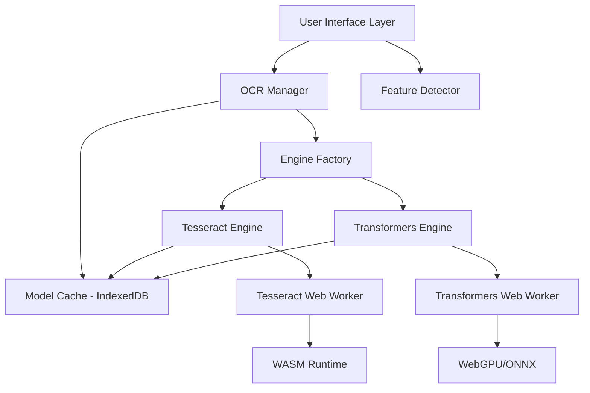

# Design Document: Multi-Engine Browser OCR System

## Overview

The Multi-Engine Browser OCR system is a client-side web application that performs optical character recognition using pluggable OCR engines. The architecture follows the Strategy Pattern to enable runtime engine selection and seamless addition of new OCR technologies.

The system is designed in two phases:
- **MVP (Phase 1)**: Single Tesseract.js engine with core infrastructure
- **Post-MVP (Phase 2)**: Add Transformers.js engine to validate multi-engine architecture

Key design principles:
- **Resource Isolation**: OCR processing runs in Web Workers to prevent UI blocking
- **Memory Safety**: Strict lifecycle management with explicit destroy() calls
- **Progressive Enhancement**: Feature detection with graceful degradation
- **Performance**: Lazy loading, model caching, and GPU acceleration where available

## Architecture

### High-Level Architecture



### Strategy Pattern Implementation

The system uses the Strategy Pattern to decouple OCR algorithm selection from the core application logic:

1. **IOCREngine Interface**: Defines the contract all engines must implement
2. **Concrete Engines**: TesseractEngine and TransformersEngine implement the interface
3. **OCR Manager**: Context that uses engines through the interface
4. **Engine Factory**: Creates and registers engine instances

This allows adding new OCR engines without modifying existing code.

### Component Responsibilities

**Feature Detector**
- Detects browser capabilities (WASM, Web Workers, IndexedDB, WebGPU)
- Returns capability report before system initialization
- Provides fallback recommendations for missing features

**OCR Manager**
- Manages engine lifecycle (load, switch, destroy)
- Coordinates between UI and active engine
- Enforces memory cleanup during engine switching
- Provides loading state to UI

**Engine Factory**
- Registers available engines with unique IDs
- Creates engine instances on demand
- Validates engine compatibility with browser capabilities

**Model Cache**
- Stores OCR models in IndexedDB
- Implements cache-first loading strategy
- Handles cache invalidation and updates
- Provides fallback to network when IndexedDB unavailable

**OCR Engines**
- Implement IOCREngine interface
- Manage Web Worker lifecycle
- Handle model loading and caching
- Process ImageData and return text
- Clean up resources on destroy()

## Components and Interfaces

### IOCREngine Interface

```typescript
interface IOCREngine {
  // Unique identifier for this engine
  readonly id: string;
  
  // Current loading state
  readonly isLoading: boolean;
  
  // Load models and initialize engine
  // Returns progress updates via callback
  load(onProgress?: (progress: number) => void): Promise<void>;
  
  // Process image and return extracted text
  process(imageData: ImageData): Promise<string>;
  
  // Clean up resources (workers, memory)
  destroy(): Promise<void>;
}
```

### OCRManager Class

```typescript
class OCRManager {
  private currentEngine: IOCREngine | null = null;
  private engineFactory: EngineFactory;
  
  constructor(factory: EngineFactory) {
    this.engineFactory = factory;
  }
  
  // Switch to a different engine
  async setEngine(engineId: string): Promise<void> {
    // Destroy previous engine if exists
    if (this.currentEngine) {
      await this.currentEngine.destroy();
      this.currentEngine = null;
    }
    
    // Create and load new engine
    this.currentEngine = this.engineFactory.create(engineId);
    await this.currentEngine.load();
  }
  
  // Run OCR on image
  async run(imageData: ImageData): Promise<string> {
    if (!this.currentEngine) {
      throw new Error('No engine selected');
    }
    return this.currentEngine.process(imageData);
  }
  
  // Get current loading state
  getLoadingState(): boolean {
    return this.currentEngine?.isLoading ?? false;
  }
}
```

### TesseractEngine Implementation

```typescript
class TesseractEngine implements IOCREngine {
  readonly id = 'tesseract';
  isLoading = false;
  
  private worker: Worker | null = null;
  private scheduler: Tesseract.Scheduler | null = null;
  
  async load(onProgress?: (progress: number) => void): Promise<void> {
    this.isLoading = true;
    
    // Create Tesseract worker
    this.worker = await Tesseract.createWorker('eng', 1, {
      logger: (m) => {
        if (m.status === 'loading' && onProgress) {
          onProgress(m.progress);
        }
      },
      // Use IndexedDB for caching
      cacheMethod: 'indexedDB'
    });
    
    this.isLoading = false;
  }
  
  async process(imageData: ImageData): Promise<string> {
    if (!this.worker) {
      throw new Error('Engine not loaded');
    }
    
    const result = await this.worker.recognize(imageData);
    return result.data.text;
  }
  
  async destroy(): Promise<void> {
    if (this.worker) {
      await this.worker.terminate();
      this.worker = null;
    }
  }
}
```

### TransformersEngine Implementation (Post-MVP)

```typescript
class TransformersEngine implements IOCREngine {
  readonly id = 'transformers';
  isLoading = false;
  
  private pipeline: any = null;
  private device: 'webgpu' | 'wasm' = 'wasm';
  
  async load(onProgress?: (progress: number) => void): Promise<void> {
    this.isLoading = true;
    
    // Detect WebGPU support
    const hasWebGPU = await this.detectWebGPU();
    this.device = hasWebGPU ? 'webgpu' : 'wasm';
    
    // Load TrOCR model
    this.pipeline = await pipeline('image-to-text', 'microsoft/trocr-base-printed', {
      device: this.device,
      cache_dir: 'indexeddb://transformers-cache',
      progress_callback: onProgress
    });
    
    this.isLoading = false;
  }
  
  async process(imageData: ImageData): Promise<string> {
    if (!this.pipeline) {
      throw new Error('Engine not loaded');
    }
    
    const result = await this.pipeline(imageData);
    return result[0].generated_text;
  }
  
  async destroy(): Promise<void> {
    if (this.pipeline) {
      await this.pipeline.dispose();
      this.pipeline = null;
    }
  }
  
  private async detectWebGPU(): Promise<boolean> {
    return 'gpu' in navigator;
  }
}
```

### EngineFactory Class

```typescript
class EngineFactory {
  private engines: Map<string, () => IOCREngine> = new Map();
  
  register(id: string, creator: () => IOCREngine): void {
    this.engines.set(id, creator);
  }
  
  create(id: string): IOCREngine {
    const creator = this.engines.get(id);
    if (!creator) {
      throw new Error(`Unknown engine: ${id}`);
    }
    return creator();
  }
  
  getAvailableEngines(): string[] {
    return Array.from(this.engines.keys());
  }
}
```

### FeatureDetector Utility

```typescript
interface BrowserCapabilities {
  wasm: boolean;
  webWorkers: boolean;
  indexedDB: boolean;
  webGPU: boolean;
  supportedEngines: string[];
}

class FeatureDetector {
  static async detect(): Promise<BrowserCapabilities> {
    const wasm = await this.detectWASM();
    const webWorkers = this.detectWebWorkers();
    const indexedDB = this.detectIndexedDB();
    const webGPU = await this.detectWebGPU();
    
    const supportedEngines: string[] = [];
    if (wasm && webWorkers && indexedDB) {
      supportedEngines.push('tesseract');
    }
    if (wasm && webWorkers && indexedDB) {
      supportedEngines.push('transformers');
    }
    
    return { wasm, webWorkers, indexedDB, webGPU, supportedEngines };
  }
  
  private static async detectWASM(): Promise<boolean> {
    try {
      return typeof WebAssembly === 'object' 
        && typeof WebAssembly.instantiate === 'function';
    } catch {
      return false;
    }
  }
  
  private static detectWebWorkers(): boolean {
    return typeof Worker !== 'undefined';
  }
  
  private static detectIndexedDB(): boolean {
    return typeof indexedDB !== 'undefined';
  }
  
  private static async detectWebGPU(): Promise<boolean> {
    return 'gpu' in navigator;
  }
}
```

### Image Processing Pipeline

```typescript
class ImageProcessor {
  // Convert file to ImageData
  static async fileToImageData(file: File): Promise<ImageData> {
    const img = await this.loadImage(file);
    const canvas = this.createCanvas(img.width, img.height);
    const ctx = canvas.getContext('2d')!;
    
    ctx.drawImage(img, 0, 0);
    return ctx.getImageData(0, 0, canvas.width, canvas.height);
  }
  
  // Apply pre-processing for better OCR accuracy
  static preprocess(imageData: ImageData): ImageData {
    const processed = new ImageData(
      new Uint8ClampedArray(imageData.data),
      imageData.width,
      imageData.height
    );
    
    // Convert to grayscale
    this.toGrayscale(processed);
    
    // Enhance contrast
    this.enhanceContrast(processed);
    
    return processed;
  }
  
  // Resize if image exceeds memory limits
  static resize(imageData: ImageData, maxDimension: number): ImageData {
    const scale = Math.min(
      maxDimension / imageData.width,
      maxDimension / imageData.height,
      1.0
    );
    
    if (scale >= 1.0) {
      return imageData;
    }
    
    const newWidth = Math.floor(imageData.width * scale);
    const newHeight = Math.floor(imageData.height * scale);
    
    const canvas = this.createCanvas(newWidth, newHeight);
    const ctx = canvas.getContext('2d')!;
    
    // Draw scaled image
    const tempCanvas = this.createCanvas(imageData.width, imageData.height);
    const tempCtx = tempCanvas.getContext('2d')!;
    tempCtx.putImageData(imageData, 0, 0);
    
    ctx.drawImage(tempCanvas, 0, 0, newWidth, newHeight);
    return ctx.getImageData(0, 0, newWidth, newHeight);
  }
  
  private static toGrayscale(imageData: ImageData): void {
    const data = imageData.data;
    for (let i = 0; i < data.length; i += 4) {
      const gray = 0.299 * data[i] + 0.587 * data[i + 1] + 0.114 * data[i + 2];
      data[i] = data[i + 1] = data[i + 2] = gray;
    }
  }
  
  private static enhanceContrast(imageData: ImageData, factor: number = 1.5): void {
    const data = imageData.data;
    const contrast = (factor - 1) * 255;
    const intercept = 128 * (1 - factor);
    
    for (let i = 0; i < data.length; i += 4) {
      data[i] = Math.max(0, Math.min(255, factor * data[i] + intercept));
      data[i + 1] = Math.max(0, Math.min(255, factor * data[i + 1] + intercept));
      data[i + 2] = Math.max(0, Math.min(255, factor * data[i + 2] + intercept));
    }
  }
  
  private static loadImage(file: File): Promise<HTMLImageElement> {
    return new Promise((resolve, reject) => {
      const img = new Image();
      img.onload = () => resolve(img);
      img.onerror = reject;
      img.src = URL.createObjectURL(file);
    });
  }
  
  private static createCanvas(width: number, height: number): HTMLCanvasElement {
    const canvas = document.createElement('canvas');
    canvas.width = width;
    canvas.height = height;
    return canvas;
  }
}
```

## Data Models

### Engine Configuration

```typescript
interface EngineConfig {
  id: string;
  name: string;
  description: string;
  requiresWebGPU: boolean;
  estimatedModelSize: number; // in MB
  supportedLanguages: string[];
}

const ENGINE_CONFIGS: Record<string, EngineConfig> = {
  tesseract: {
    id: 'tesseract',
    name: 'Tesseract.js',
    description: 'Traditional OCR engine with broad language support',
    requiresWebGPU: false,
    estimatedModelSize: 4.5,
    supportedLanguages: ['eng']
  },
  transformers: {
    id: 'transformers',
    name: 'Transformers.js (TrOCR)',
    description: 'Transformer-based OCR with higher accuracy',
    requiresWebGPU: false, // Optional, falls back to CPU
    estimatedModelSize: 85,
    supportedLanguages: ['eng']
  }
};
```

### OCR Result

```typescript
interface OCRResult {
  text: string;
  confidence?: number;
  processingTime: number;
  engineId: string;
}
```

### Loading State

```typescript
interface LoadingState {
  isLoading: boolean;
  progress: number; // 0-100
  stage: 'idle' | 'downloading' | 'initializing' | 'processing' | 'complete' | 'error';
  message: string;
}
```

### Error Types

```typescript
class OCRError extends Error {
  constructor(
    message: string,
    public code: OCRErrorCode,
    public recoverable: boolean = true
  ) {
    super(message);
    this.name = 'OCRError';
  }
}

enum OCRErrorCode {
  UNSUPPORTED_BROWSER = 'UNSUPPORTED_BROWSER',
  ENGINE_LOAD_FAILED = 'ENGINE_LOAD_FAILED',
  PROCESSING_FAILED = 'PROCESSING_FAILED',
  MEMORY_EXHAUSTED = 'MEMORY_EXHAUSTED',
  INVALID_IMAGE = 'INVALID_IMAGE',
  NETWORK_ERROR = 'NETWORK_ERROR'
}
```


## Correctness Properties

*A property is a characteristic or behavior that should hold true across all valid executions of a system—essentially, a formal statement about what the system should do. Properties serve as the bridge between human-readable specifications and machine-verifiable correctness guarantees.*

### Property Reflection

After analyzing all acceptance criteria, several redundant properties were identified:
- Requirements 2.3, 6.1, and 9.3 all test that destroy() is called during engine switching - consolidated into Property 2
- Requirements 1.3, 1.4, and 1.5 all test feature detection before initialization - consolidated into Property 1
- Multiple requirements test engine interface compliance - consolidated into Property 3

The following properties represent the unique, non-redundant correctness guarantees for the system:

### Property 1: Feature Detection Precedes Initialization

*For any* OCR engine initialization or model cache creation, the Feature_Detector must verify required browser capabilities (WASM, Web Workers, IndexedDB) before proceeding with initialization.

**Validates: Requirements 1.3, 1.4, 1.5**

### Property 2: Engine Switching Cleanup

*For any* pair of OCR engines, when switching from engine A to engine B, the Engine_Manager must call destroy() on engine A before loading engine B, ensuring no resource leaks occur.

**Validates: Requirements 2.3, 6.1, 9.3**

### Property 3: Engine Interface Compliance

*For any* OCR engine implementation, it must expose the IOCREngine interface with load(), process(), destroy(), and isLoading members, and process() must accept ImageData and return a string.

**Validates: Requirements 2.4, 2.5**

### Property 4: Engine Registration and Retrieval

*For any* OCR engine registered with the Engine_Manager, it must be retrievable by its unique identifier, and the identifier must remain consistent across registration and retrieval.

**Validates: Requirements 2.2**

### Property 5: Worker Termination on Destroy

*For any* OCR engine instance, calling destroy() must terminate all associated Web Workers, preventing orphaned worker threads.

**Validates: Requirements 3.4, 6.2**

### Property 6: Image Format Support

*For any* image file in supported formats (JPEG, PNG, WebP, BMP), the ImageProcessor must successfully convert it to a canvas element and extract ImageData without errors.

**Validates: Requirements 4.1, 4.2, 4.3**

### Property 7: Image Resizing for Large Images

*For any* image with dimensions exceeding the maximum threshold, the ImageProcessor must resize it to fit within memory limits while preserving aspect ratio.

**Validates: Requirements 4.4**

### Property 8: Image Preprocessing Application

*For any* ImageData input, the preprocessing pipeline must apply grayscale conversion and contrast enhancement, resulting in modified pixel values.

**Validates: Requirements 4.5**

### Property 9: Model Caching Round Trip

*For any* OCR model downloaded by an engine, storing it in IndexedDB and then loading it from IndexedDB must produce an equivalent model that functions identically to the network-downloaded version.

**Validates: Requirements 5.1, 5.3**

### Property 10: Cache-First Loading Strategy

*For any* engine load operation, the Model_Cache must check IndexedDB for cached models before initiating network downloads, ensuring cached models are used when available.

**Validates: Requirements 5.2**

### Property 11: Lazy Model Loading

*For any* OCR engine registration, no model downloads or network requests should occur until the engine's load() method is explicitly called.

**Validates: Requirements 5.5**

### Property 12: Loading State Propagation

*For any* OCR engine during the loading phase, the isLoading property must be true, and the Engine_Manager must reflect this state to the UI layer.

**Validates: Requirements 7.1, 7.2**

### Property 13: Result Display on Success

*For any* successful OCR operation, the extracted text must be made available to the UI layer and displayed to the user.

**Validates: Requirements 7.3**

### Property 14: Error Message Display

*For any* error condition (engine load failure, processing failure, memory exhaustion), the OCR_System must display a clear error message with the error type and recovery suggestions.

**Validates: Requirements 7.4, 10.3**

### Property 15: WebGPU Conditional Acceleration

*For any* Transformers engine initialization, if WebGPU is available, the engine must use GPU acceleration; if WebGPU is unavailable, the engine must fall back to CPU processing without errors.

**Validates: Requirements 8.2, 8.3**

### Property 16: WebGPU Detection Precedes Acceleration

*For any* attempt to use GPU acceleration, the Feature_Detector must verify WebGPU support before enabling GPU mode.

**Validates: Requirements 8.5**

### Property 17: Engine Selection Persistence

*For any* engine selection made by the user, the selection must be persisted to browser storage and restored on subsequent sessions.

**Validates: Requirements 9.4**

### Property 18: Missing Feature Reporting

*For any* required browser feature that is unavailable, the OCR_System must report which specific features are missing in the error message.

**Validates: Requirements 10.1**

### Property 19: Download Retry with Backoff

*For any* model download failure, the OCR_System must retry the download with exponentially increasing delays between attempts.

**Validates: Requirements 10.2**

### Property 20: Error Logging

*For any* error that occurs in the system, detailed error information must be logged to the browser console for debugging purposes.

**Validates: Requirements 10.5**

## Error Handling

### Error Categories

**Initialization Errors**
- Missing browser features (WASM, Web Workers, IndexedDB)
- Unsupported browser version
- Feature detection failures

**Loading Errors**
- Model download failures (network errors, timeouts)
- IndexedDB access failures
- Worker creation failures
- WASM instantiation failures

**Processing Errors**
- Invalid image format
- Image too large for memory
- OCR engine crashes
- Worker communication failures

**Memory Errors**
- WASM memory exhaustion
- Browser memory limits exceeded
- Failed to allocate resources

### Error Recovery Strategies

**Network Errors**
- Retry with exponential backoff (1s, 2s, 4s, 8s, 16s)
- Maximum 5 retry attempts
- Fall back to alternative CDN if available
- Display offline mode message if all retries fail

**Memory Errors**
- Suggest image resizing to user
- Offer to switch to lighter engine (Tesseract vs Transformers)
- Clear model cache to free space
- Terminate and restart worker

**Feature Detection Failures**
- Display specific missing features
- Provide browser upgrade recommendations
- Link to compatibility documentation
- Gracefully disable unsupported features

**Processing Failures**
- Allow user to retry with same image
- Suggest image preprocessing adjustments
- Offer alternative engine if available
- Log detailed error for debugging

### Error Message Format

```typescript
interface ErrorMessage {
  title: string;
  description: string;
  code: OCRErrorCode;
  recoverable: boolean;
  suggestions: string[];
  technicalDetails?: string;
}
```

Example error messages:

```typescript
const ERROR_MESSAGES: Record<OCRErrorCode, ErrorMessage> = {
  UNSUPPORTED_BROWSER: {
    title: 'Browser Not Supported',
    description: 'Your browser does not support required features for OCR.',
    code: OCRErrorCode.UNSUPPORTED_BROWSER,
    recoverable: false,
    suggestions: [
      'Upgrade to Chrome 90+, Firefox 88+, or Safari 15+',
      'Enable WebAssembly in browser settings',
      'Check that JavaScript is enabled'
    ]
  },
  MEMORY_EXHAUSTED: {
    title: 'Memory Limit Exceeded',
    description: 'The image is too large to process with available memory.',
    code: OCRErrorCode.MEMORY_EXHAUSTED,
    recoverable: true,
    suggestions: [
      'Try a smaller image or lower resolution',
      'Switch to Tesseract engine (uses less memory)',
      'Close other browser tabs to free memory'
    ]
  },
  ENGINE_LOAD_FAILED: {
    title: 'Failed to Load OCR Engine',
    description: 'Could not download or initialize the OCR engine.',
    code: OCRErrorCode.ENGINE_LOAD_FAILED,
    recoverable: true,
    suggestions: [
      'Check your internet connection',
      'Try refreshing the page',
      'Clear browser cache and reload'
    ]
  }
};
```

## Testing Strategy

### Dual Testing Approach

The system requires both unit tests and property-based tests for comprehensive coverage:

**Unit Tests** focus on:
- Specific examples of supported image formats
- Edge cases (empty images, corrupted files, extreme dimensions)
- Error conditions (network failures, missing features)
- Integration points between components
- Browser-specific behavior

**Property-Based Tests** focus on:
- Universal properties that hold for all inputs
- Engine lifecycle management across random engine sequences
- Image processing across random image dimensions and formats
- Caching behavior across random model data
- State transitions across random operation sequences

### Property-Based Testing Configuration

**Library Selection**: Use `fast-check` for JavaScript/TypeScript property-based testing

**Test Configuration**:
- Minimum 100 iterations per property test
- Each test must reference its design document property
- Tag format: `Feature: multi-engine-browser-ocr, Property {number}: {property_text}`

**Example Property Test Structure**:

```typescript
import fc from 'fast-check';

describe('Feature: multi-engine-browser-ocr', () => {
  // Property 2: Engine Switching Cleanup
  it('Property 2: Engine switching must call destroy() on previous engine', async () => {
    await fc.assert(
      fc.asyncProperty(
        fc.array(fc.constantFrom('tesseract', 'transformers'), { minLength: 2, maxLength: 5 }),
        async (engineSequence) => {
          const manager = new OCRManager(factory);
          const destroySpies = new Map();
          
          for (let i = 0; i < engineSequence.length; i++) {
            const engineId = engineSequence[i];
            await manager.setEngine(engineId);
            
            // Verify previous engine was destroyed
            if (i > 0) {
              const prevEngineId = engineSequence[i - 1];
              expect(destroySpies.get(prevEngineId)).toHaveBeenCalled();
            }
          }
        }
      ),
      { numRuns: 100 }
    );
  });
  
  // Property 7: Image Resizing for Large Images
  it('Property 7: Large images must be resized to fit memory limits', () => {
    fc.assert(
      fc.property(
        fc.integer({ min: 5000, max: 20000 }), // width
        fc.integer({ min: 5000, max: 20000 }), // height
        (width, height) => {
          const largeImageData = createMockImageData(width, height);
          const resized = ImageProcessor.resize(largeImageData, 4096);
          
          // Verify dimensions are within limits
          expect(resized.width).toBeLessThanOrEqual(4096);
          expect(resized.height).toBeLessThanOrEqual(4096);
          
          // Verify aspect ratio preserved
          const originalAspect = width / height;
          const resizedAspect = resized.width / resized.height;
          expect(Math.abs(originalAspect - resizedAspect)).toBeLessThan(0.01);
        }
      ),
      { numRuns: 100 }
    );
  });
});
```

### Unit Test Coverage

**Component Tests**:
- FeatureDetector: Test each capability detection method
- EngineFactory: Test registration and creation
- OCRManager: Test engine switching, state management
- ImageProcessor: Test format conversion, preprocessing, resizing
- TesseractEngine: Test loading, processing, cleanup
- TransformersEngine: Test WebGPU detection, fallback, processing

**Integration Tests**:
- End-to-end OCR flow: upload → process → display
- Engine switching with active processing
- Cache hit/miss scenarios
- Error recovery flows

**Browser Compatibility Tests**:
- Feature detection across browsers
- WASM instantiation
- Worker communication
- IndexedDB operations

### Test Data

**Image Test Data**:
- Sample images in all supported formats (JPEG, PNG, WebP, BMP)
- Various dimensions (small, medium, large, extreme)
- Different content types (text, handwriting, mixed)
- Edge cases (1x1 pixel, all white, all black, corrupted)

**Model Test Data**:
- Mock model files for caching tests
- Various sizes to test memory limits
- Corrupted data for error handling

### Mocking Strategy

**External Dependencies**:
- Mock Tesseract.js worker creation
- Mock Transformers.js pipeline
- Mock IndexedDB operations
- Mock Web Worker communication
- Mock fetch for model downloads

**Browser APIs**:
- Mock WebAssembly for unsupported browser tests
- Mock navigator.gpu for WebGPU tests
- Mock canvas and ImageData creation

### Performance Testing

While not part of automated unit/property tests, the following performance characteristics should be manually validated:

- Model loading time: < 5 seconds on 10 Mbps connection
- OCR processing time: < 3 seconds for typical document image
- Memory usage: < 500 MB for Tesseract, < 1.5 GB for Transformers
- UI responsiveness: No frame drops during processing
- Cache hit performance: < 500ms to load from IndexedDB

## Implementation Notes

### Phase 1 (MVP) Scope

**Included**:
- Tesseract.js engine only
- Basic UI with file upload
- Loading states and progress
- IndexedDB caching
- Feature detection
- Error handling
- Image preprocessing

**Excluded from MVP**:
- Transformers.js engine (Post-MVP)
- Engine selection UI (Post-MVP)
- WebGPU acceleration (Post-MVP)
- Multiple language support (Post-MVP)
- Batch processing (Future)
- PDF support (Future)

### Phase 2 (Post-MVP) Scope

**Included**:
- Transformers.js engine with TrOCR
- Engine selection dropdown
- WebGPU detection and acceleration
- CPU fallback for Transformers
- Engine comparison UI
- Performance metrics display

### Technology Stack

**Core Libraries**:
- Tesseract.js v5.x for traditional OCR
- Transformers.js for transformer-based OCR
- TypeScript for type safety
- fast-check for property-based testing
- Jest or Vitest for unit testing

**Browser APIs**:
- WebAssembly for OCR execution
- Web Workers for threading
- IndexedDB for model caching
- Canvas API for image processing
- WebGPU for GPU acceleration (Post-MVP)

**Build Tools**:
- Vite or Webpack for bundling
- TypeScript compiler
- ESLint for code quality
- Prettier for formatting

### Security Considerations

**Input Validation**:
- Validate file types before processing
- Limit file sizes to prevent DoS
- Sanitize extracted text before display
- Validate ImageData dimensions

**Resource Limits**:
- Maximum image dimensions: 8192x8192
- Maximum file size: 50 MB
- Maximum concurrent workers: 2
- Model download timeout: 60 seconds

**Content Security**:
- Use Content Security Policy (CSP) headers
- Load models from trusted CDNs only
- Validate model integrity if possible
- Isolate worker execution context

### Browser Compatibility Matrix

| Feature | Chrome 90+ | Firefox 88+ | Safari 15+ |
|---------|-----------|-------------|-----------|
| WASM | ✅ | ✅ | ✅ |
| Web Workers | ✅ | ✅ | ✅ |
| IndexedDB | ✅ | ✅ | ✅ |
| WebGPU | ✅ (113+) | ⚠️ (Experimental) | ⚠️ (Experimental) |
| Tesseract.js | ✅ | ✅ | ✅ |
| Transformers.js | ✅ | ✅ | ✅ |

✅ = Fully supported
⚠️ = Experimental/partial support
❌ = Not supported

### Deployment Considerations

**CDN Strategy**:
- Host models on CDN for fast global access
- Use versioned URLs for cache busting
- Provide fallback CDN URLs
- Consider self-hosting for offline scenarios

**Bundle Size**:
- Core application: ~50 KB (gzipped)
- Tesseract.js: ~2 MB (lazy loaded)
- Transformers.js: ~5 MB (lazy loaded)
- Models: 4.5 MB (Tesseract), 85 MB (TrOCR)

**Optimization**:
- Code splitting for engine implementations
- Lazy load engines on demand
- Compress models with gzip/brotli
- Use service workers for offline support (Future)
